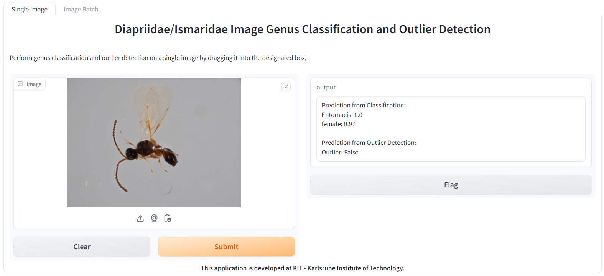
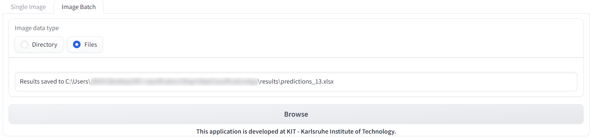

# Diapriidae and Ismaridae Genus and Sex Classification and Outlier Detection

This repository contains a machine learning application for predicting the genus and sex of Diapriidae and Ismaridae images using the Vision Transformer Architecture BEiTV2 and outlier detection (predict whether an insect does not belong to any of the learned classes). The application provides a user-friendly web interface for both single-image and batch processing.

This repository is based on the work published in the following paper:

**"Image-based recognition of parasitoid wasps using advanced neural networks"**

You can access the full text of the paper here: [Full Text](https://www.publish.csiro.au/is/Fulltext/IS24011).

### Original Repository

The original repository for this project is hosted on GitLab. You can find it here:

[GitLab Repository](https://gitlab.kit.edu/kit/iai/ber/diapriidaeclassificationapp)

## Table of Contents

- [Getting Started](#getting-started)
  - [Prerequisites](#prerequisites)
  - [Installation](#installation)
- [Usage](#usage)
  - [Single Image Prediction](#single-image-prediction)
  - [Batch Inference](#batch-inference)
<!-- - [Contributing](#contributing) -->
<!-- - [License](#license) -->

## Getting Started

### Prerequisites

Before running the application, you need to have the following prerequisites:

- Anaconda Package Manager ([Download](https://www.anaconda.com/download))
- If using Microsoft Windows OS: Microsoft Visual C++ Redistributable (In many cases already installed. You can [install it here](https://support.microsoft.com/help/2977003/the-latest-supported-visual-c-downloads/))

### Installation

0. Open Windows PowerShell.

1. Create a new folder for this project at your desire path and navigate to it in Windows PowerShell:

   ```powershell
   mkdir <path/to/diapriidae_classification_app>
   cd <path/to/diapriidae_classification_app>
   ```

2. Clone the repository to your local machine:

   ```bash
   git clone https://gitlab.kit.edu/kit/iai/ber/diapriidaeclassificationapp.git
   cd diapriidaeclassificationapp
   ```

3. Create a virtual environment using Anaconda and activate it:

   ```bash
   conda create -n diapriidae_app python=3.10 anaconda --yes
   conda activate diapriidae_app
   ```

4. Install the required dependencies from `requirements.txt`:

   ```bash
   pip install -r requirements.txt
   ```

5. Download the GroundingDINO weights file. If the provided link does not work, check the [GroundingDINO Installation Guide](https://github.com/IDEA-Research/GroundingDINO#hammer_and_wrench-install) (Step 4: Download pre-trained model weights).

   ```bash
   curl -O weights/groundingdino_swint_ogc.pth https://github.com/IDEA-Research/GroundingDINO/releases/download/v0.1.0-alpha/groundingdino_swint_ogc.pth
   ```

6. Start the application:

   ```bash
   python src/app.py
   ```

As soon as the Application is running a browser window should open automatically. You can perform genus/sex classification and outlier detection on single images or perform batch inference on multiple images or alternatively on all images inside a directory.

## Usage

### Single Image Prediction


1. You will see two tabs: "Single Image" and "Image Folder." Select the "Single Image" tab.

2. Drag and drop an image into the designated box.

3. Click the "Predict" button to initiate the inference process.

4. The classification and outlier detection results will be displayed on the screen based on the image.



### Batch Inference

1. Select the "Image Batch" tab.

2. Inside the "Image data type" box specify if multiple images or all Images inside a directory should be predicted.

3. Click the "Browse" button and specify the images or the image folder to serve as input.

4. The application will process the specified images and generate prediction results in Excel file inside the output folder. The path of the Excel file will be displayed on the screen as soon as it is created.


